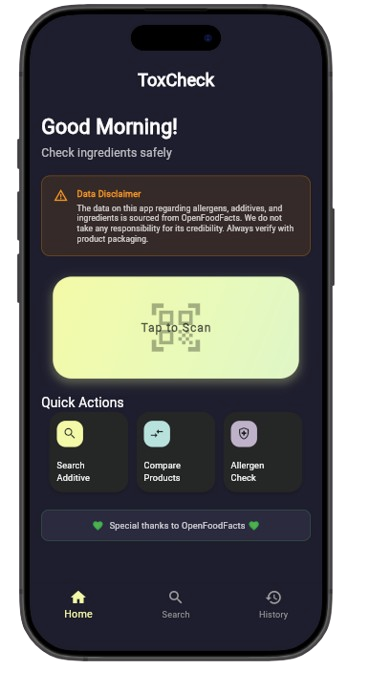
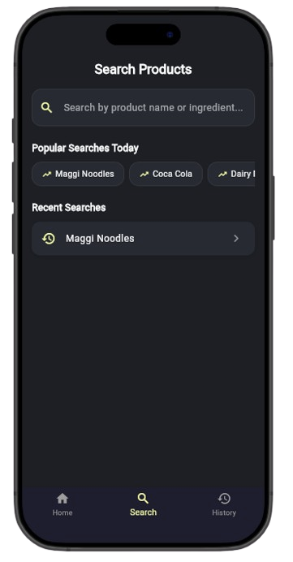
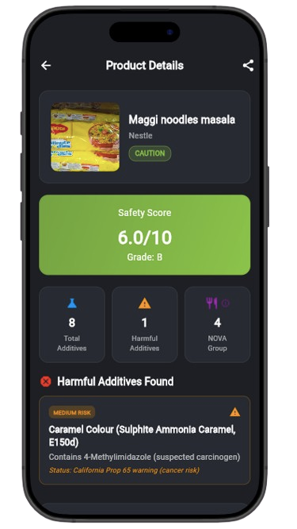
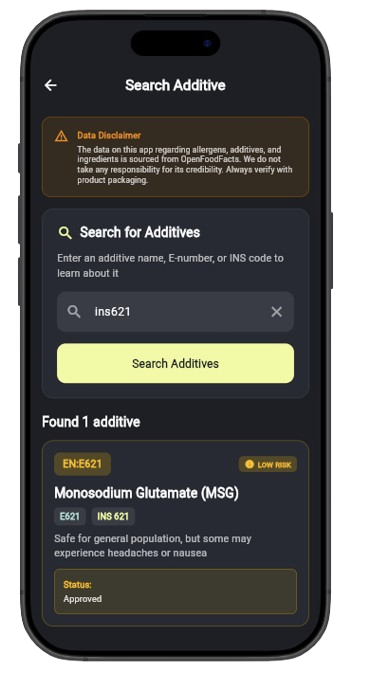
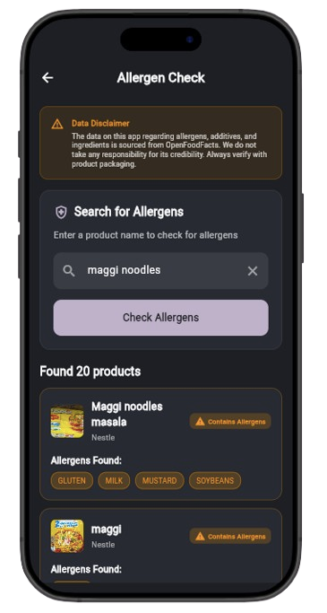
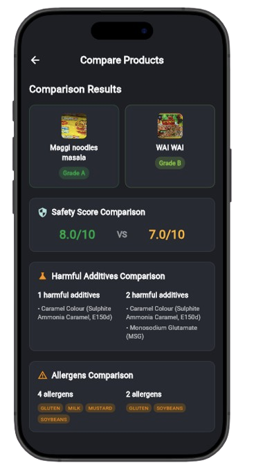
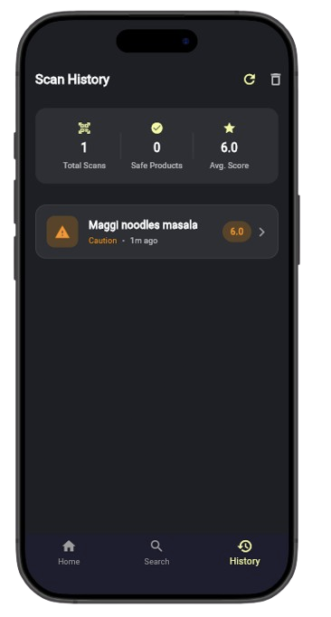

# ToxCheck

A easy to use Flutter application designed to help users make informed decisions about food safety by checking ingredients, additives, and allergens in products.

## ✨ Features

- **Barcode Scanning**: Instantly scan product barcodes for quick identification
- **Text Search**: Search products by name or brand
- **Recent Searches**: Quick access to previously searched items
- **Product Details**: Comprehensive product information display
- **Toxic Additive Detection**: Identify harmful additives in products
- **Safety Ratings**: Clear safety indicators for each additive
- **Detailed Information**: Learn about specific additives and their effects
- **Allergen Detection**: Identify common allergens in products
- **Side-by-Side Analysis**: Compare multiple products simultaneously
## 📸 Screenshots

### Home Screen


*Clean interface with quick actions and personalized greetings*

### Product Search


*Powerful search functionality with recent searches*

### Product Details


*Comprehensive product information and safety analysis*

### Additive Analysis


*Detailed additive information and safety ratings*

### Allergen Checking


*Allergen detection and safety warnings*

### Product Comparison


*Side-by-side product comparison for informed decisions*

### History & Analytics


*Track scanning history and usage analytics*

## 🛠️ Technical Stack

- **Framework**: Flutter 3.x
- **Language**: Dart
- **Local Storage**: Hive (NoSQL database)
- **Data Source**: OpenFoodFacts API
- **State Management**: StatefulWidget with GlobalKey pattern
- **Navigation**: Bottom Navigation with IndexedStack
- **Architecture**: Clean separation of concerns with services layer

## 🗂️ Project Structure

```
lib/
├── main.dart                 # App entry point
├── models/                   # Data models
│   ├── product.dart
│   ├── scan_history.dart
│   └── toxic_additive.dart
├── pages/                    # UI screens
│   ├── home_page.dart
│   ├── search_page.dart
│   ├── history_page.dart
│   ├── product_details_page.dart
│   ├── additive_search_page.dart
│   ├── allergen_check_page.dart
│   └── compare_products_page.dart
├── services/                 # Business logic
│   ├── local_storage_service.dart
│   ├── product_service.dart
│   └── toxic_additive_service.dart
├── widgets/                  # Reusable components
│   ├── scan_card.dart
│   └── quick_action_card.dart
└── theme/                    # App theming
    └── app_colors.dart
```

## 🚀 Getting Started

### Prerequisites
- Flutter SDK (3.0 or higher)
- Dart SDK
- Android Studio / VS Code
- iOS Simulator / Android Emulator

### Installation

1. **Clone the repository**
   ```bash
   git clone https://github.com/nikkhilpareek/ToxCheck.git
   cd ToxCheck
   ```

2. **Install dependencies**
   ```bash
   flutter pub get
   ```

3. **Run the application**
   ```bash
   flutter run
   ```

### Building for Production

**Android APK:**
```bash
flutter build apk --release
```

**iOS IPA:**
```bash
flutter build ios --release
```

## 📊 Data Sources

This app utilizes data from **OpenFoodFacts**, an open database of food products worldwide. We express our gratitude to the OpenFoodFacts community for their invaluable contribution to food transparency.

**Data Disclaimer**: The information provided in this app is sourced from OpenFoodFacts and should be used for informational purposes only. Always verify product information with official packaging and consult healthcare professionals for medical advice.

## 🤝 Contributing

Contributions are welcome! Please feel free to submit a Pull Request. For major changes, please open an issue first to discuss what you would like to change.

1. Fork the Project
2. Create your Feature Branch (`git checkout -b feature/AmazingFeature`)
3. Commit your Changes (`git commit -m 'Add some AmazingFeature'`)
4. Push to the Branch (`git push origin feature/AmazingFeature`)
5. Open a Pull Request

## 📞 Author
**Nikhil Pareek** - [@nikkhilpareek](https://github.com/nikkhilpareek)


## 🙏 Acknowledgments

- **OpenFoodFacts** for providing comprehensive food product data
- **Flutter Team** for the amazing framework

---
